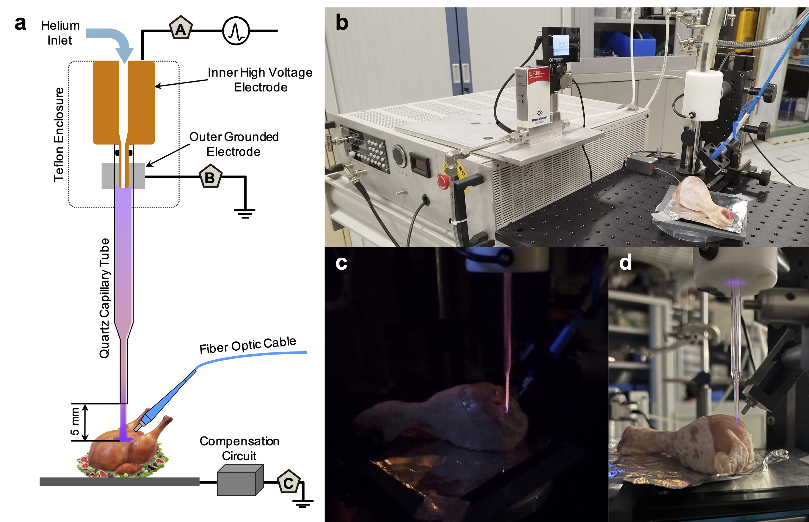

# CAP-Sensor4Bio

This repository contains the code and data for "A Cold Atmospheric Plasma Sensor for Identification and Differentiation of Biological Tissues," a collaborative project between the Mesbah Lab at the University of California, Berkeley and GREMI at CRNS/Universit\'e d'Orl\'eans. Please cite our work using the following 
```bibtex

```

This repostiory contains:
<p align="center">

</p>

* raw data files collected via the GREMI Plasma Gun and automatic data acquisition setup -- the automatic data acquisition was performed using Python and the corresponding codes to collect data for the GREMI Plasma Gun setup are located at the [PlasmaGun repository](https://github.com/kchan45/PlasmaGun)

* code script used in processing the raw data and training various machine learning (ML) models to classify tissue type

<p align="center">

</p>

## File Descriptions

* `images` contains images used for this (and potentially other) README's.

* `README.md` is this file.

* `main.ipynb` is the main file to process the raw data, create training/validation/testing sets, and train ML models. Note that the paths should be changed according to the user. This file was originally created in Google Colab; to run locally, a local Python envrionment should be created with `requirements.txt`.

* `data` includes subdirectories that contain the raw data, processed data, and final ML model training/validation/testing datasets.

**Note: While this work is under review, this repository is subject to change. Only changes made to increase user-friendliness will be made; no changes will be made to the results of the work.**